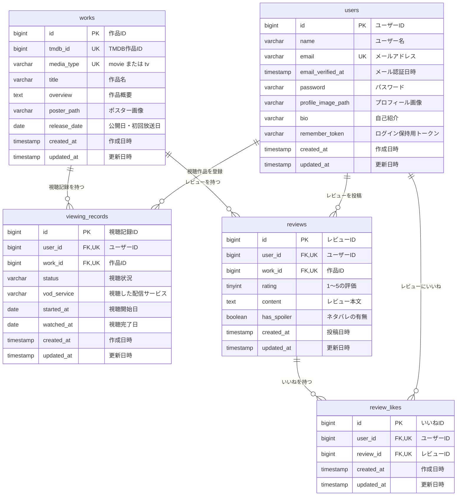

# ER図

動画視聴管理・レビューアプリで使用するデータベースの構成です。

テーブルの詳細な定義については、[テーブル仕様書](https://docs.google.com/spreadsheets/d/12PhXt0fo1otrrtjXkOP4x9LF3UyFw96oJ7vN3iqy65w/edit?gid=1188247583#gid=1188247583)を参照してください。

## テーブル間の関係

- ユーザーは複数の作品をマイリストへ登録できます。
- 作品は複数ユーザーの視聴記録を持ちます。
- ユーザーは複数のレビューを投稿できます。
- 作品は複数のレビューを持ちます。
- ユーザーは複数のレビューに「いいね」できます。
- レビューは複数の「いいね」を持ちます。

## 複合ユニーク制約

| テーブル | 対象カラム | 目的 |
|---|---|---|
| `works` | `tmdb_id`, `media_type` | 同じTMDB作品の重複登録を防ぐ |
| `viewing_records` | `user_id`, `work_id` | 同じユーザーによる同一作品の重複登録を防ぐ |
| `reviews` | `user_id`, `work_id` | 1ユーザーにつき1作品1レビューに制限する |
| `review_likes` | `user_id`, `review_id` | 同じレビューへの重複した「いいね」を防ぐ |

## インデックス

| テーブル | 対象カラム | 目的 |
|---|---|---|
| `viewing_records` | `user_id`, `status` | ユーザーのマイリストを視聴状況で絞り込む |
| `reviews` | `created_at` | レビューを新着順で取得する |

## カラムの補足

### `viewing_records.status`

次のいずれかを保存します。

- `want_to_watch`：観たい
- `watching`：視聴中
- `watched`：視聴済み
- `dropped`：中断

### `reviews.has_spoiler`

- `false`：ネタバレなし
- `true`：ネタバレあり
- 初期値は`false`